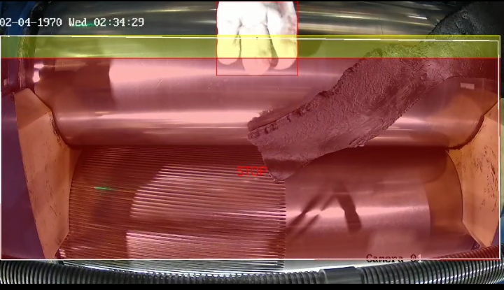
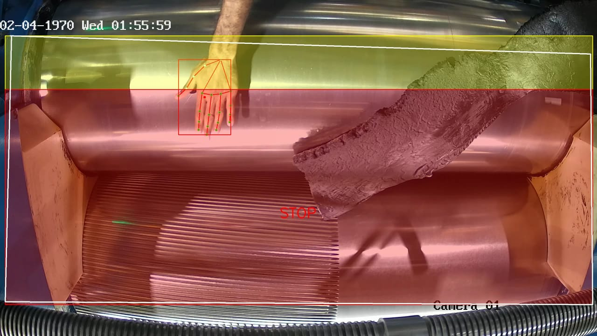
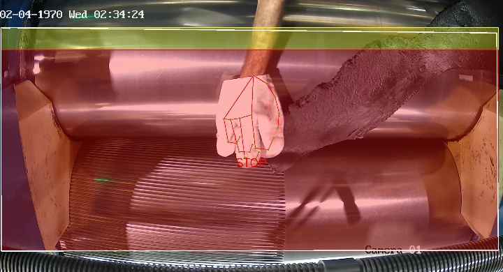
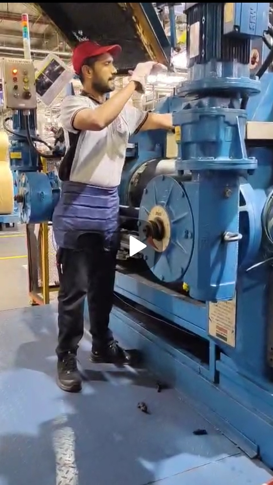
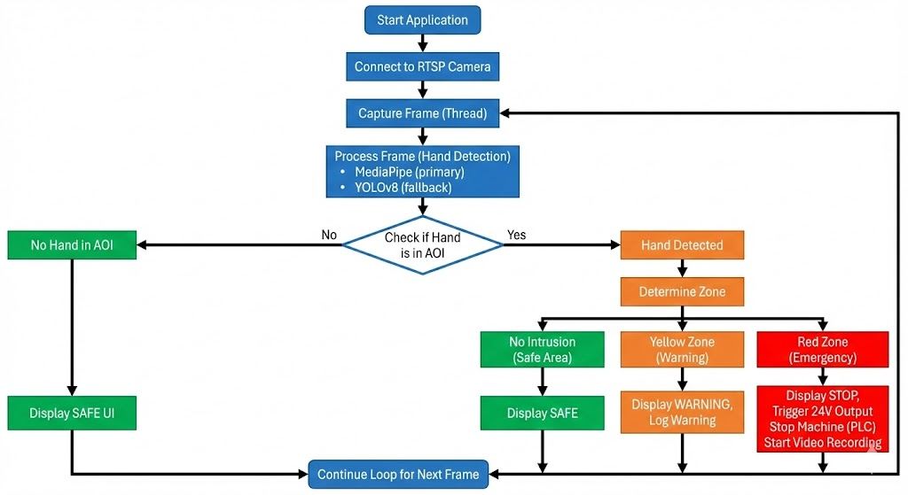
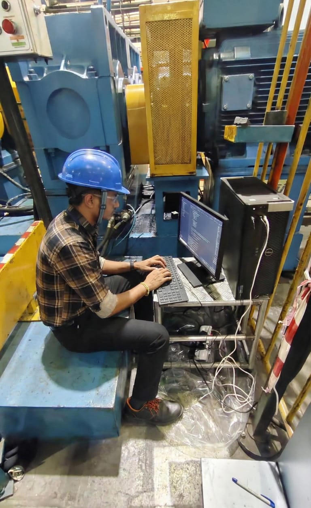

# Hand-Detection-and-Safety-Zone-Monitoring-System
Real Time Industrial Safety Monitoring with Hikvision RTSP Camera, MediaPipe, YOLOv8 and Automated PLC Triggering

## Problem Statement by Bridgestone India Private Limited,Pune

In a rubber processing line, a high RPM roller machine is used for rubber flattening.  
If a worker's hand crosses a certain area near the roller, the material and roller can pull in the arm, which can cause serious injury or even death.

The goal is to build a vision based system that can:

- Detect a human hand near the roller using a camera.
- Define a configurable danger area in front of the machine.
- Give a **warning** if a hand enters a caution zone.
- Give a **stop signal** if a hand enters a critical zone.
- Provide a 24 V DC output which can be wired to a PLC or emergency stop circuit.
- Record video automatically during dangerous events.
## AOI Example

 

Video 👇

https://github.com/Ksb-Kaushal/Hand-Detection-and-Safety-Zone-Monitoring-System/blob/main/Demonstration_Video

Video 👇

https://github.com/Ksb-Kaushal/Hand-Detection-and-Safety-Zone-Monitoring-System/blob/main/System_Demo_video

---
This repository contains a working prototype of such a system implemented in a single Python file.

## System Overview  

The system uses:

- **Hikvision IP Camera** DS-2CD1021-I, 2.8 mm, 1080p with RTSP stream.
- **MediaPipe Hands** for fast landmark based hand detection.
- **YOLOv8** custom model as fallback detector.
- **OpenCV** for RTSP capture, drawing overlays and recording.
- A configurable **Area Of Interest (AOI)** drawn by an admin on the live camera view.

The AOI is automatically split into:

- **Yellow zone**: warning zone, machine slowdown or attention required.
- **Red zone**: emergency zone, machine stop and automatic video recording.

All logic is in a single file: `hand_safety_monitor.py`.

---

## Features  

- Real time hand detection from an RTSP camera.
- Admin can draw custom AOI polygon directly on the live camera image.
- Automatic split of AOI into yellow (warning) and red (emergency) zones.
- Warning messages when a hand enters the yellow zone.
- Emergency messages and video recording when a hand enters the red zone.
- Designed to be connected to a 24 V DC output for PLC / relay integration (hardware wiring not included in code).

---
## Me

